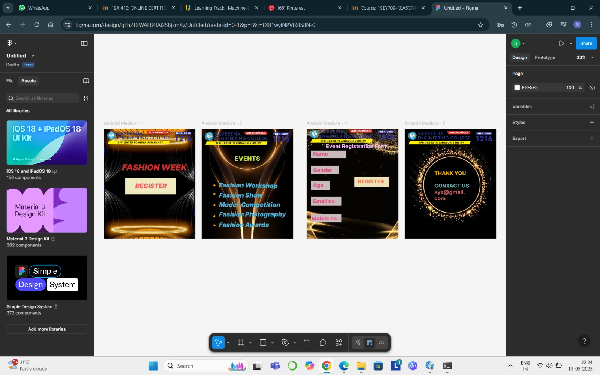

# Ex09 Event Registration Web Application
## Date:15/05/2025 NAME:DIVYASHREE B

## AIM:
To design, develop and deploy a web application for event registration.

## DESIGN STEPS:

### Step 1:
Create a new frame.

### Step 2:
Select any one preset size of your choice.

### Step 3:
Select the shapes you need.

### Step 4:
Import images as needed.

### Step 5:
Create pages based on your need and link them.

### Step 6:

Validate the HTML and CSS code.

### Step 6:

Publish the website in the given URL.

## DESIGN TOOL:
Figma

## CODE:
```
HOME PAGE

(HTML CODE)

<div class="container--0-">
  <svg
    width="386"
    height="125"
    viewBox="0 0 386 125"
    fill="none"
    xmlns="http://www.w3.org/2000/svg"
  >
    <rect width="386" height="125" fill="#F0EAC1"></rect>
  </svg>
  <div class="text-0-1-3">REGISTER</div>
  <div class="text-0-1-4">FASHION WEEK</div>
</div>

(CSS CODE)

.container--0- {
  position: absolute;
  left: 156px;
  top: -534px;
  width: 700px;
  height: 840px;
  background-color: #ffffff;
  justify-content: start;
  align-items: start;
}
.text-0-1-3 {
  width: 247px;
  height: 79px;
  color: #eb5f62;
  font-size: 48px;
  font-family: Inter, "Black Italic";
  font-weight: 900;
  text-align: left;
  vertical-align: top;
}
.text-0-1-4 {
  width: 636px;
  height: 137px;
  color: #cd2e2e;
  font-size: 64px;
  font-family: Inter, "Black Italic";
  font-weight: 900;
  text-align: left;
  vertical-align: top;
}

EVENT PAGE

(HTML CODE)

<div class="container--0-">
  
  <div class="text-0-1-1"></div>
  <div class="text-0-1-2"></div>
  <div class="text-0-1-3">Fashion Show</div>
  <div class="text-0-1-4"></div>
  <div class="text-0-1-5">EVENTS</div>
  <div class="text-0-1-6"></div>
  <div class="text-0-1-7">Model Competition</div>
  <div class="text-0-1-8"></div>
  <div class="text-0-1-9">Fashion Photography</div>
  <div class="text-0-1-10"></div>
  <div class="text-0-1-11">Fashion Workshop</div>
  <div class="text-0-1-12">Fashion Awards</div>
  
</div>

(CSS CODE)

.container--0- {
  position: absolute;
  left: 905px;
  top: -534px;
  width: 700px;
  height: 840px;
  background-color: #ffffff;
  justify-content: start;
  align-items: start;
}
.text-0-1-1 {
  width: 78.92813110351562px;
  height: 80.80972290039062px;
  color: #feae00;
  font-size: 48px;
  font-family: Inter, "Black Italic";
  font-weight: 900;
  text-align: left;
  vertical-align: top;
}
.text-0-1-2 {
  width: 72px;
  height: 58px;
  color: #feae00;
  font-size: 48px;
  font-family: Inter, "Black Italic";
  font-weight: 900;
  text-align: left;
  vertical-align: top;
}
.text-0-1-3 {
  width: 394px;
  height: 56px;
  color: #50b2d6;
  font-size: 48px;
  font-family: Inter, "Black Italic";
  font-weight: 900;
  text-align: left;
  vertical-align: top;
}
.text-0-1-4 {
  height: 58px;
  color: #ffffff;
  font-size: 48px;
  font-family: Inter, "Black Italic";
  font-weight: 900;
  text-align: left;
  vertical-align: top;
}
.text-0-1-5 {
  width: 224px;
  height: 78px;
  color: #c5e934;
  font-size: 48px;
  font-family: Inter, "Extra Bold";
  font-weight: 800;
  text-align: left;
  vertical-align: top;
}
.text-0-1-6 {
  width: 72px;
  height: 58px;
  color: #feae00;
  font-size: 48px;
  font-family: Inter, "Black Italic";
  font-weight: 900;
  text-align: left;
  vertical-align: top;
}
.text-0-1-7 {
  width: 527px;
  height: 73px;
  color: #50b2d6;
  font-size: 48px;
  font-family: Inter, "Black Italic";
  font-weight: 900;
  text-align: left;
  vertical-align: top;
}
.text-0-1-8 {
  width: 72px;
  height: 46px;
  color: #feae00;
  font-size: 48px;
  font-family: Inter, "Black Italic";
  font-weight: 900;
  text-align: left;
  vertical-align: top;
}
.text-0-1-9 {
  width: 548px;
  height: 58px;
  color: #50b2d6;
  font-size: 48px;
  font-family: Inter, "Black Italic";
  font-weight: 900;
  text-align: left;
  vertical-align: top;
}
.text-0-1-10 {
  width: 72px;
  height: 66px;
  color: #feae00;
  font-size: 48px;
  font-family: Inter, "Black Italic";
  font-weight: 900;
  text-align: left;
  vertical-align: top;
}
.text-0-1-11 {
  width: 470.7294616699219px;
  height: 77.99140930175781px;
  color: #50b2d6;
  font-size: 48px;
  font-family: Inter, "Black Italic";
  font-weight: 900;
  text-align: left;
  vertical-align: top;
}
.text-0-1-12 {
  width: 401px;
  height: 107px;
  color: #50b2d6;
  font-size: 48px;
  font-family: Inter, "Black Italic";
  font-weight: 900;
  text-align: left;
  vertical-align: top;
}

REGISTRATION PAGE

(HTML CODE)

<div class="container--0-">
  <svg
    width="269"
    height="57"
    viewBox="0 0 269 57"
    fill="none"
    xmlns="http://www.w3.org/2000/svg"
  >
    <rect width="269" height="57" fill="#C9BBBB"></rect>
  </svg>
  <div class="text-0-1-2">Name</div>
  <div class="text-0-1-3">Event Registration Form</div>
  <svg
    width="212"
    height="64"
    viewBox="0 0 212 64"
    fill="none"
    xmlns="http://www.w3.org/2000/svg"
  >
    <rect width="212" height="64" fill="#C9BBBB"></rect>
  </svg>
  <div class="text-0-1-5">Gender</div>
  <svg
    width="144"
    height="71"
    viewBox="0 0 144 71"
    fill="none"
    xmlns="http://www.w3.org/2000/svg"
  >
    <path d="M0 0H144V70.5H0V0Z" fill="#C9BBBB"></path>
  </svg>
  <div class="text-0-1-7">Age</div>
  <svg
    width="231"
    height="69"
    viewBox="0 0 231 69"
    fill="none"
    xmlns="http://www.w3.org/2000/svg"
  >
    <path d="M0 0H115.5H231V69H0V0Z" fill="#C9BBBB"></path></svg
  ><svg
    width="231"
    height="69"
    viewBox="0 0 231 69"
    fill="none"
    xmlns="http://www.w3.org/2000/svg"
  >
    <path d="M0 0H115.5H231V69H0V0Z" fill="#C9BBBB"></path>
  </svg>
  <div class="text-0-1-10">Email no</div>
  <svg
    width="231"
    height="64"
    viewBox="0 0 231 64"
    fill="none"
    xmlns="http://www.w3.org/2000/svg"
  >
    <rect width="231" height="64" fill="#C9BBBB"></rect>
  </svg>
  <div class="text-0-1-12">Mobile no</div>
  <svg
    width="265"
    height="79"
    viewBox="0 0 265 79"
    fill="none"
    xmlns="http://www.w3.org/2000/svg"
  >
    <rect width="265" height="79" fill="#EEE2BA"></rect>
  </svg>
  <div class="text-0-1-14">REGISTER</div>
  
</div>

(CSS CODE)

.container--0- {
  position: absolute;
  left: 1709px;
  top: -534px;
  width: 700px;
  height: 840px;
  background-color: #ffffff;
  justify-content: start;
  align-items: start;
}
.text-0-1-2 {
  width: 271px;
  height: 57px;
  color: #e44f88;
  font-size: 40px;
  font-family: Inter, "Extra Bold";
  font-weight: 800;
  text-align: left;
  vertical-align: top;
}
.text-0-1-3 {
  width: 494px;
  height: 59px;
  color: #f2b7ff;
  font-size: 40px;
  font-family: Inter, "Extra Bold";
  font-weight: 800;
  text-align: left;
  vertical-align: top;
}
.text-0-1-5 {
  width: 266px;
  height: 73px;
  color: #e44f88;
  font-size: 40px;
  font-family: Inter, "Extra Bold";
  font-weight: 800;
  text-align: left;
  vertical-align: top;
}
.text-0-1-7 {
  width: 125px;
  height: 52px;
  color: #e44f88;
  font-size: 40px;
  font-family: Inter, "Extra Bold";
  font-weight: 800;
  text-align: left;
  vertical-align: top;
}
.text-0-1-10 {
  width: 216px;
  height: 60px;
  color: #e44f88;
  font-size: 40px;
  font-family: Inter, "Extra Bold";
  font-weight: 800;
  text-align: left;
  vertical-align: top;
}
.text-0-1-12 {
  width: 218px;
  height: 41px;
  color: #e44f88;
  font-size: 40px;
  font-family: Inter, "Extra Bold";
  font-weight: 800;
  text-align: left;
  vertical-align: top;
}
.text-0-1-14 {
  width: 220px;
  height: 55px;
  color: #f57b52;
  font-size: 40px;
  font-family: Inter, "Extra Bold";
  font-weight: 800;
  text-align: left;
  vertical-align: top;
}

CONTACT PAGE

(HTML CODE)

<div class="container--0-">
  
  <div class="text-0-1-2">
    THANK YOU<br /><br />CONTACT US:<br />xyz@gmail.com
  </div>
</div>

(CSS CODE)

.container--0- {
  position: absolute;
  left: 2458px;
  top: -534px;
  width: 700px;
  height: 840px;
  background-color: #ffffff;
  justify-content: start;
  align-items: start;
}
.text-0-1-2 {
  width: 279px;
  height: 221px;
  font-size: 40px;
  font-family: Inter, "Extra Bold";
  font-weight: 800;
  text-align: left;
  vertical-align: top;
}
```

## OUTPUT:


## RESULT:
The program to design, develop and deploy a web application for event registration is completed successfully.
